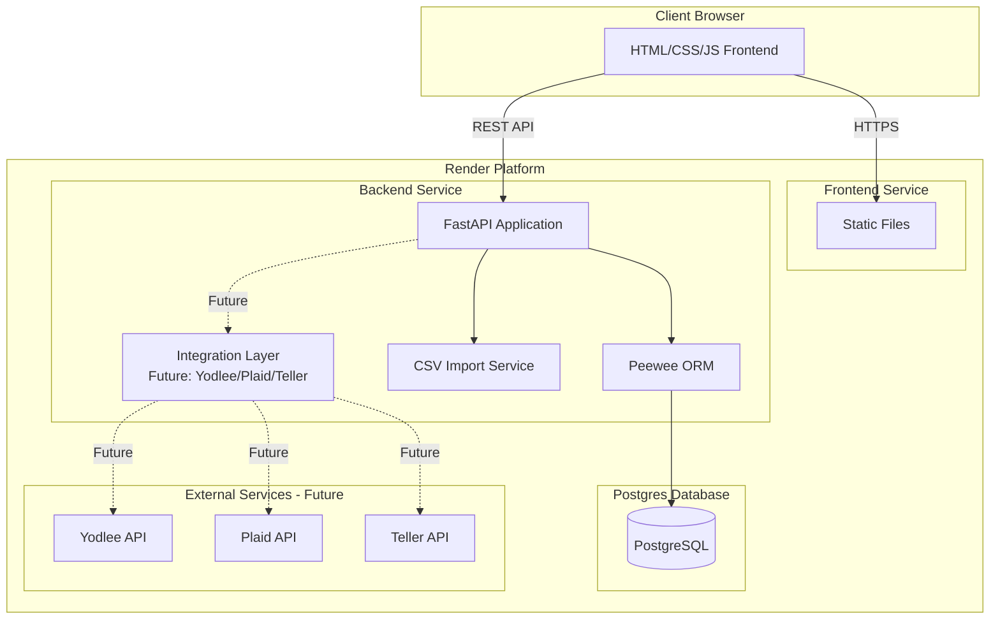

# Finance

App - Project Plan

## Project Goals

Build a personal finance application for budgeting, expense tracking, and lightweight accounting. The application should be:

- **User-focused**: Multi-user support with secure authentication
- **Comprehensive**: Track expenses, manage budgets, handle multiple accounts, and generate reports
- **Maintainable**: Clean architecture that supports future expansion
- **Deployable**: Ready for production deployment on Render

## Objectives

### MVP Features

1. **User Management**: Multi-user authentication and authorization
2. **Account Management**: Multiple accounts (checking, savings, credit cards) with balance tracking
3. **Transaction Management**: 

- Income and expense transactions
- Transaction categorization (predefined + custom categories)
- Recurring transaction support
- Multi-bank CSV import: Flexible CSV parser supporting various bank statement formats (Chase, Bank of America, Wells Fargo, Citi, Capital One, etc.) with automatic format detection and field mapping

4. **Budgeting**: 

- Multiple budget periods (monthly, quarterly, yearly)
- Budget rollover capabilities
- Budget alerts and notifications

5. **Chart of Accounts**: Structured account hierarchy for accounting
6. **Reporting**: Basic financial reports (income vs expenses, category breakdowns)

### Future Expansion Considerations

- **Bank API Integrations**: Architecture designed to support Yodlee, Plaid, Teller, or similar services for automatic account synchronization
- **Family/Group Features**: Database schema supports multi-user families with shared accounts, budgets, and financial data
- Multi-currency support
- Advanced reporting and analytics
- Mobile app
- Investment tracking
- Tax reporting features

## Architecture

### System Architecture




### Technology Stack

**Backend:**

- Python 3.11+
- FastAPI (web framework)
- Peewee (ORM)
- httpx (for external API calls if needed)
- python-jose (JWT authentication)
- passlib (password hashing)

**Frontend:**

- Vanilla JavaScript (ES6+)
- HTML5
- CSS3
- Rollup (bundler)
- No framework dependencies

**Database:**

- PostgreSQL (via Render Postgres)

**Deployment:**

- Render (frontend static site + backend service)

### Project Structure

```javascript
finance_app/
├── backend/
│   ├── src/
│   │   ├── main.py                 # FastAPI app entry point
│   │   ├── models/                 # Peewee models
│   │   │   ├── __init__.py
│   │   │   ├── user.py
│   │   │   ├── account.py
│   │   │   ├── transaction.py
│   │   │   ├── category.py
│   │   │   ├── budget.py
│   │   │   ├── chart_of_accounts.py
│   │   │   ├── family.py            # Future: Family support
│   │   │   └── bank_integration.py   # Future: Bank API integrations
│   │   ├── api/                    # API routes
│   │   │   ├── __init__.py
│   │   │   ├── auth.py
│   │   │   ├── accounts.py
│   │   │   ├── transactions.py
│   │   │   ├── categories.py
│   │   │   ├── budgets.py
│   │   │   └── reports.py
│   │   ├── services/               # Business logic
│   │   │   ├── __init__.py
│   │   │   ├── auth_service.py
│   │   │   ├── transaction_service.py
│   │   │   ├── budget_service.py
│   │   │   ├── import_service.py
│   │   │   └── integrations/       # Bank integration services (future)
│   │   │       ├── __init__.py
│   │   │       ├── base.py         # Base integration interface
│   │   │       └── csv_parser.py    # Multi-bank CSV parsing
│   │   ├── schemas/                # Pydantic schemas
│   │   │   ├── __init__.py
│   │   │   ├── user.py
│   │   │   ├── account.py
│   │   │   ├── transaction.py
│   │   │   └── ...
│   │   ├── utils/                  # Utilities
│   │   │   ├── __init__.py
│   │   │   ├── database.py
│   │   │   ├── security.py
│   │   │   └── validators.py
│   │   └── config.py               # Configuration
│   ├── tests/
│   ├── requirements.txt
│   ├── .env.example
│   └── Dockerfile                  # For Render deployment
│
├── frontend/
│   ├── src/
│   │   ├── index.html
│   │   ├── css/
│   │   │   └── main.css
│   │   ├── js/
│   │   │   ├── main.js
│   │   │   ├── api.js              # API client
│   │   │   ├── auth.js             # Authentication
│   │   │   ├── accounts.js         # Account management
│   │   │   ├── transactions.js     # Transaction management
│   │   │   ├── budgets.js          # Budget management
│   │   │   ├── reports.js          # Reports
│   │   │   └── utils.js            # Utilities
│   │   └── assets/
│   ├── dist/                       # Rollup output
│   ├── rollup.config.js
│   ├── package.json
│   └── .env.example
│
├── docs/
│   └── PROJECT_PLAN.md             # This document
│
└── README.md
```


## Database Schema

### Core Tables

**Users**

- `id` (PK, UUID)
- `username` (unique)
- `email` (unique)
- `hashed_password`
- `created_at`
- `updated_at`
- `is_active`

**Families** (Future: Not implemented in MVP, but schema ready)

- `id` (PK, UUID)
- `name` (family/group name)
- `created_by_user_id` (FK to Users)
- `created_at`
- `updated_at`

**FamilyMembers** (Future: Not implemented in MVP, but schema ready)

- `id` (PK, UUID)
- `family_id` (FK to Families)
- `user_id` (FK to Users)
- `role` (admin, member)
- `status` (pending, approved, active)
- `invited_by_user_id` (FK to Users)
- `invited_at`
- `approved_at` (nullable)
- `created_at`
- `updated_at`

**Accounts**

- `id` (PK, UUID)
- `user_id` (FK to Users, owner of account)
- `family_id` (FK to Families, nullable - for shared family accounts)
- `name` (e.g., "Chase Checking")
- `account_type` (checking, savings, credit_card, investment, etc.)
- `balance` (decimal, current balance)
- `currency` (default: USD)
- `is_active`
- `is_shared` (boolean, indicates if account is shared with family)
- `created_at`
- `updated_at`

**Categories**

- `id` (PK, UUID)
- `user_id` (FK to Users, nullable for system categories)
- `name`
- `parent_category_id` (FK, nullable, for subcategories)
- `category_type` (income, expense, both)
- `is_system` (boolean, for predefined categories)
- `created_at`
- `updated_at`

**Transactions**

- `id` (PK, UUID)
- `user_id` (FK to Users, creator/owner)
- `family_id` (FK to Families, nullable - for family-shared transactions)
- `account_id` (FK to Accounts)
- `category_id` (FK to Categories)
- `amount` (decimal, positive for income, negative for expenses)
- `description`
- `transaction_date`
- `transaction_type` (income, expense, transfer)
- `transfer_to_account_id` (FK, nullable, for transfers)
- `is_recurring` (boolean)
- `recurring_template_id` (FK, nullable)
- `created_at`
- `updated_at`

**RecurringTransactions**

- `id` (PK, UUID)
- `user_id` (FK to Users)
- `account_id` (FK to Accounts)
- `category_id` (FK to Categories)
- `amount` (decimal)
- `description`
- `frequency` (daily, weekly, monthly, yearly)
- `interval` (integer, e.g., every 2 weeks)
- `start_date`
- `end_date` (nullable)
- `next_occurrence`
- `is_active`
- `created_at`
- `updated_at`

**Budgets**

- `id` (PK, UUID)
- `user_id` (FK to Users)
- `category_id` (FK to Categories)
- `amount` (decimal, budget limit)
- `period_type` (monthly, quarterly, yearly)
- `period_start` (date)
- `period_end` (date)
- `rollover_enabled` (boolean)
- `rollover_amount` (decimal, nullable)
- `alert_threshold` (decimal, nullable, percentage)
- `created_at`
- `updated_at`

**ChartOfAccounts**

- `id` (PK, UUID)
- `user_id` (FK to Users)
- `account_code` (string, e.g., "1000", "2000")
- `account_name`
- `account_type` (asset, liability, equity, income, expense)
- `parent_account_id` (FK, nullable, for hierarchy)
- `is_active`
- `created_at`
- `updated_at`

**TransactionImports**

- `id` (PK, UUID)
- `user_id` (FK to Users)
- `filename`
- `import_date`
- `status` (pending, completed, failed)
- `records_imported` (integer)
- `errors` (JSON, nullable)
- `bank_format` (string, nullable - detected bank format for CSV)
- `created_at`

**BankIntegrations** (Future: Not implemented in MVP, but schema ready)

- `id` (PK, UUID)
- `user_id` (FK to Users)
- `account_id` (FK to Accounts, nullable - for account-level integration)
- `integration_type` (yodlee, plaid, teller, etc.)
- `external_account_id` (string, account ID from integration provider)
- `access_token` (encrypted, OAuth token from provider)
- `refresh_token` (encrypted, nullable)
- `token_expires_at` (nullable)
- `is_active`
- `last_sync_at` (nullable)
- `sync_frequency` (daily, weekly, manual)
- `created_at`
- `updated_at`

### Relationships

- Users → Accounts (1:N, owner)
- Users → Transactions (1:N, creator)
- Users → Categories (1:N, with system categories shared)
- Users → Budgets (1:N)
- Users → Families (1:N, creator)
- Families → FamilyMembers (1:N)
- Users → FamilyMembers (1:N, member of families)
- Families → Accounts (1:N, shared family accounts)
- Families → Transactions (1:N, family-shared transactions)
- Accounts → Transactions (1:N)
- Accounts → BankIntegrations (1:N, future)
- Categories → Transactions (1:N)
- Categories → Categories (self-referential, for subcategories)
- Transactions → Accounts (transfer relationship)
- RecurringTransactions → Transactions (template relationship)

## API Endpoints

**Note**: All API endpoints use JSON for request/response bodies. The API follows RESTful principles with standard HTTP methods and status codes.

### Authentication

- `POST /api/auth/register` - User registration (JSON body)
- `POST /api/auth/login` - User login (JSON body, returns JWT)
- `POST /api/auth/refresh` - Refresh JWT token (JSON body)
- `GET /api/auth/me` - Get current user info

### Accounts

- `GET /api/accounts` - List user accounts
- `POST /api/accounts` - Create account (JSON body)
- `GET /api/accounts/{id}` - Get account details
- `PUT /api/accounts/{id}` - Update account (JSON body)
- `DELETE /api/accounts/{id}` - Delete account (soft delete)

### Transactions

- `GET /api/transactions` - List transactions (with filters: date range, account, category)
- `POST /api/transactions` - Create transaction (JSON body)
- `GET /api/transactions/{id}` - Get transaction details
- `PUT /api/transactions/{id}` - Update transaction (JSON body)
- `DELETE /api/transactions/{id}` - Delete transaction
- `POST /api/transactions/import` - Import transactions (JSON body: array of transactions or base64-encoded CSV content)

### Categories

- `GET /api/categories` - List categories (system + user)
- `POST /api/categories` - Create custom category (JSON body)
- `PUT /api/categories/{id}` - Update category (JSON body)
- `DELETE /api/categories/{id}` - Delete category

### Recurring Transactions

- `GET /api/recurring-transactions` - List recurring transactions
- `POST /api/recurring-transactions` - Create recurring transaction (JSON body)
- `PUT /api/recurring-transactions/{id}` - Update recurring transaction (JSON body)
- `DELETE /api/recurring-transactions/{id}` - Delete recurring transaction
- `POST /api/recurring-transactions/{id}/generate` - Manually generate next occurrence

### Budgets

- `GET /api/budgets` - List budgets
- `POST /api/budgets` - Create budget (JSON body)
- `GET /api/budgets/{id}` - Get budget details
- `PUT /api/budgets/{id}` - Update budget (JSON body)
- `DELETE /api/budgets/{id}` - Delete budget
- `GET /api/budgets/{id}/status` - Get budget status (spent vs limit)

### Reports

- `GET /api/reports/income-expense` - Income vs expense summary
- `GET /api/reports/category-breakdown` - Category-wise spending
- `GET /api/reports/account-balances` - Account balance summary
- `GET /api/reports/budget-status` - Budget status across all budgets

### Chart of Accounts

- `GET /api/chart-of-accounts` - List chart of accounts
- `POST /api/chart-of-accounts` - Create account entry (JSON body)
- `PUT /api/chart-of-accounts/{id}` - Update account entry (JSON body)
- `DELETE /api/chart-of-accounts/{id}` - Delete account entry

## Build and Deploy Processes

### Backend Build Process

1. **Local Development:**

- Install dependencies: `pip install -r requirements.txt`
- Set up environment variables (`.env` file)
- Run database migrations (Peewee will handle schema creation)
- Start development server: `uvicorn src.main:app --reload`

2. **Render Deployment:**

- Use Python buildpack
- Build command: `pip install -r requirements.txt`
- Start command: `uvicorn src.main:app --host 0.0.0.0 --port $PORT`
- Environment variables configured in Render dashboard:
    - `DATABASE_URL` (from Render Postgres)
    - `SECRET_KEY` (JWT secret)
    - `ALGORITHM` (JWT algorithm, default HS256)
    - `ACCESS_TOKEN_EXPIRE_MINUTES`

### Frontend Build Process

1. **Local Development:**

- Install dependencies: `npm install`
- Development server: `npm run dev` (using a simple HTTP server)
- Watch mode: `npm run watch` (Rollup in watch mode)

2. **Production Build:**

- Build command: `npm run build`
- Rollup bundles JS, minifies, and outputs to `dist/`
- HTML and CSS copied to `dist/`

3. **Render Deployment:**

- Deploy as static site
- Build command: `npm install && npm run build`
- Publish directory: `dist`
- Environment variables:
    - `VITE_API_URL` or `API_URL` (backend API endpoint)

### Database Setup

1. **Local Development:**

- Local PostgreSQL instance or Docker container
- Connection string in `.env`

2. **Render Postgres:**

- Create Postgres database in Render dashboard
- Connection string automatically provided as `DATABASE_URL`
- Backend connects using this URL

### Deployment Checklist

**Backend:**

- [ ] Create Render web service
- [ ] Connect Render Postgres database
- [ ] Set environment variables
- [ ] Configure build and start commands
- [ ] Deploy and verify database connection
- [ ] Test API endpoints

**Frontend:**

- [ ] Create Render static site
- [ ] Configure build command
- [ ] Set API URL environment variable
- [ ] Deploy and verify API connectivity
- [ ] Test authentication flow

## Task List

### Phase 1: Project Setup

1. Create project structure (backend/ and frontend/ folders)
2. Initialize backend Python project with FastAPI
3. Initialize frontend project with Rollup
4. Set up development environment configuration files
5. Create database connection utilities

### Phase 2: Database & Models

1. Set up Peewee database connection
2. Create User model and authentication tables
3. Create Account model
4. Create Category model (with system categories seed data)
5. Create Transaction model
6. Create RecurringTransaction model
7. Create Budget model
8. Create ChartOfAccounts model
9. Create TransactionImport model
10. Set up database migrations/initialization script

### Phase 3: Backend API - Core

1. Implement authentication service (JWT)
2. Create auth API endpoints
3. Implement account management API
4. Implement transaction management API
5. Implement category management API
6. Add API request/response validation (Pydantic schemas)
7. Add error handling middleware

### Phase 4: Backend API - Advanced Features

1. Implement recurring transaction service
2. Create recurring transaction API endpoints
3. Implement budget service with rollover logic
4. Create budget API endpoints
5. Implement CSV import service with multi-bank format support:

- Accepts JSON: array of transactions or base64-encoded CSV content
- Bank format detection (Chase, BofA, Wells Fargo, Citi, etc.)
- Configurable field mappings per bank format
- Flexible date/amount parsing

6. Create import API endpoint (JSON body)
7. Implement chart of accounts API

### Phase 5: Backend API - Reports

1. Implement income/expense report service
2. Implement category breakdown report service
3. Implement budget status report service
4. Create report API endpoints

### Phase 6: Frontend - Core

1. Set up HTML structure and routing
2. Create API client utility
3. Implement authentication UI and logic
4. Create navigation and layout components
5. Implement account management UI
6. Implement transaction list and form UI
7. Implement category management UI

### Phase 7: Frontend - Advanced Features

1. Implement recurring transaction UI
2. Implement budget management UI
3. Implement CSV import UI
4. Implement chart of accounts UI
5. Add form validation and error handling

### Phase 8: Frontend - Reports & Polish

1. Implement report visualization (charts/tables)
2. Add dashboard with summary widgets
3. Implement budget alerts UI
4. Add loading states and user feedback
5. Style and responsive design

### Phase 9: Testing & Deployment

1. Write backend API tests
2. Test CSV import functionality
3. Test recurring transaction generation
4. Test budget rollover logic
5. Set up Render Postgres database
6. Deploy backend to Render
7. Deploy frontend to Render
8. End-to-end testing
9. Documentation

## Key Design Decisions

1. **API Design**: Fully RESTful API using JSON-only for all request/response bodies. No form data or multipart uploads - CSV imports accept JSON (either array of transaction objects or base64-encoded CSV content)
2. **Payment Methods**: Account-based approach - payment method inferred from the account type (credit card account = credit card payment)
3. **Currency**: Single currency (USD) for MVP, schema supports expansion to multi-currency
4. **Authentication**: JWT-based authentication for stateless API
5. **Database**: Peewee ORM for simplicity and Pythonic syntax, with PostgreSQL for production
6. **Frontend**: Vanilla JS to keep bundle size small and maintainability high
7. **Deployment**: Render for both services to simplify infrastructure management
8. **CSV Import**: Flexible multi-bank CSV parser that detects and handles different bank statement formats (Chase, Bank of America, Wells Fargo, etc.) with configurable field mappings
9. **Extensibility**: Architecture designed with abstraction layers to support future bank API integrations (Yodlee, Plaid, Teller) without major refactoring
10. **Family Features**: Database schema includes family support (Families, FamilyMembers tables) but not implemented in MVP - ready for future expansion

## Extensibility Architecture

### Bank Integration Abstraction

The architecture is designed to support future bank API integrations through an abstraction layer:**Base Integration Interface** (`services/integrations/base.py`):

- Abstract base class defining common methods: `connect()`, `sync_accounts()`, `fetch_transactions()`, `refresh_token()`
- All integration providers (Yodlee, Plaid, Teller) will implement this interface
- Allows swapping providers without changing core transaction/budget logic

**Integration Flow**:

1. User initiates OAuth flow with chosen provider
2. Provider returns access/refresh tokens
3. Tokens stored encrypted in `BankIntegrations` table
4. Background job or manual trigger syncs accounts/transactions
5. Transactions imported using same validation logic as CSV imports

**CSV Import Enhancement**:

- Multi-format CSV parser with bank-specific format detection
- Configurable field mappings per bank (date format, amount sign, column positions)
- Support for common formats: Chase, Bank of America, Wells Fargo, Citi, Capital One, etc.
- User can specify bank format or auto-detect from CSV structure

### Family Feature Architecture

Database schema supports families but MVP focuses on single-user experience:**Future Implementation Path**:

1. Add family creation/invitation API endpoints
2. Implement family member approval workflow
3. Add family-scoped queries for accounts, transactions, budgets
4. Implement permission system (admin vs member roles)